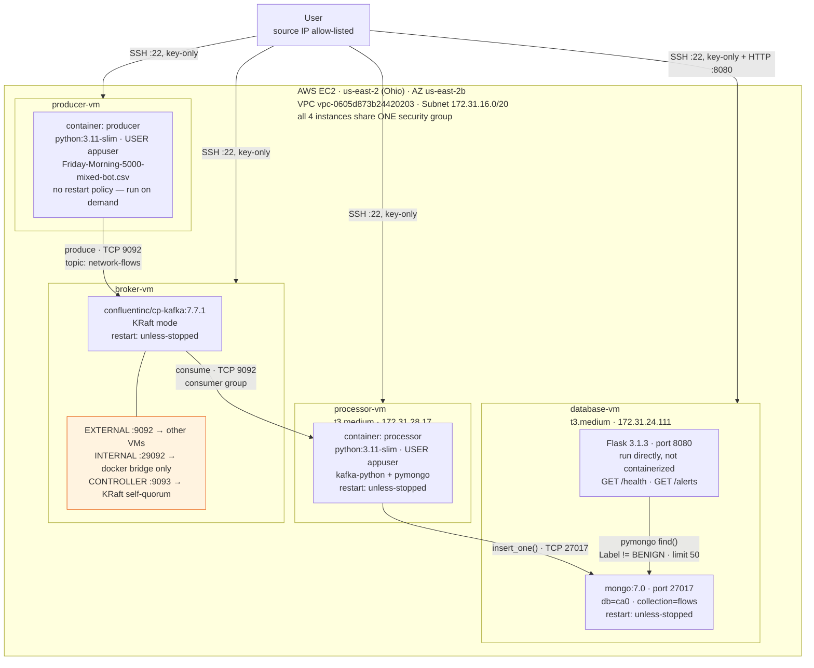

# CA0 — Real-Time Network Intrusion Detection Pipeline

*Last updated: September 6, 2026*

## Overview
This project implements CA0's required Producer → Pub/Sub → Processor → Database pipeline as a real-time network intrusion detection system. The producer replays labeled network flow records from the CICIDS2017 dataset; the processor consumes them and writes results to MongoDB; a REST API exposes flagged attack traffic. All four pieces run on four separate AWS EC2 instances.

## Architecture Diagram





## Software Stack

| Component | Technology | Version |
|---|---|---|
| Pub/Sub hub | Apache Kafka (KRaft mode, no ZooKeeper) | `confluentinc/cp-kafka:7.7.1` |
| Database | MongoDB | `mongo:7.0` |
| Producer | Python + `kafka-python`, Dockerized | Python 3.11-slim |
| Processor | Python + `kafka-python` + `pymongo`, Dockerized | Python 3.11-slim |
| REST API | Flask | 3.1.3 |
| Container runtime | Docker Engine + Compose plugin | 29.8.0 |
| Host OS | Ubuntu | 26.04 LTS |
| Cloud provider | AWS EC2 | us-east-2 (Ohio), AZ us-east-2b |

## Environment

| VM | Role | Instance Type | Private IP | Subnet CIDR |
|---|---|---|---|---|
| producer-vm | Producer container | t3.medium | 172.31.18.106 | 172.31.16.0/20 |
| broker-vm | Kafka (KRaft) | t3.medium | 172.31.21.128 | 172.31.16.0/20 |
| processor-vm | Processor container | t3.medium | 172.31.28.17 | 172.31.16.0/20 |
| database-vm | MongoDB + REST API | t3.medium | 172.31.24.111 | 172.31.16.0/20 |

Subnet: `subnet-0b00ba7301f12884e`, availability zone `us-east-2b`, VPC `vpc-0605d873b24420203` (default VPC). Confirmed directly from the AWS console.

All four instances share one key pair (`ca0-key.pem`) and one security group. Public IPs are reassigned by AWS on every instance stop/start and are therefore not listed here as fixed values — check the EC2 console for current ones when connecting.


*All four instances (producer, broker, processor, database) up simultaneously.*

## Configuration Summary

| Component | Image / Version | Host | Port | Restart policy |
|---|---|---|---|---|
| Kafka broker | `confluentinc/cp-kafka:7.7.1` | broker-vm | 9092 (external), 29092 (internal), 9093 (controller) | `unless-stopped` (confirmed via `docker inspect`) |
| MongoDB | `mongo:7.0` | database-vm | 27017 | `unless-stopped` (confirmed via `docker inspect`) |
| Producer | custom, `python:3.11-slim` base | producer-vm | outbound only | none — triggered manually on demand, not a persistent service |
| Processor | custom, `python:3.11-slim` base | processor-vm | outbound only | `unless-stopped` (confirmed via `docker inspect`) |
| REST API | Flask 3.1.3 | database-vm | 8080 | none — run manually; not containerized (see Deviations) |

## Security

- **SSH**: key-only authentication (`ca0-key.pem`). Verified directly, not assumed — `sudo sshd -T | grep passwordauthentication` returns `passwordauthentication no` on the VMs checked.

  
  *`sshd -T` confirming password login is off.*

- **Firewall** (one shared security group): exactly four inbound rules —
  - `22/tcp` (SSH) — source: my IP
  - `9092/tcp` (Kafka) — source: this security group only (self-referencing)
  - `27017/tcp` (MongoDB) — source: this security group only (self-referencing)
  - `8080/tcp` (REST API) — source: my IP

  Ports 22 and 8080 are reachable from outside (by design — that's how I access them); ports 9092 and 27017 are reachable only by the four VMs themselves. That's the actual trust boundary: external access is limited to what a human operator needs, internal service-to-service traffic is limited to the VMs that make up the pipeline.

  
  *Inbound rules scoped to my IP for human-facing ports, and to the security group itself for inter-VM ports.*

- **Non-root containers**: both the producer and processor Dockerfiles create and switch to an unprivileged `appuser` before running (`USER appuser`), confirmed in the build output of both images.

  
  *`USER appuser` set before the container's entrypoint runs.*

## Data Flow

1. **Producer** (producer-vm) reads rows from a CICIDS2017-derived CSV, converts each row to JSON, and publishes it to the Kafka topic `network-flows`.
2. **Kafka** (broker-vm) holds messages on that topic. Its external listener advertises the broker's private IP so the producer and processor — on separate machines — can actually reach it.
3. **Processor** (processor-vm) consumes each message and inserts it into MongoDB's `ca0.flows` collection. Any row not labeled `BENIGN` is also printed as a `[ALERT]` line.
4. **REST API** (database-vm) exposes `GET /alerts`, querying MongoDB directly for any record where `Label != "BENIGN"`.

## Dataset

Base dataset: CICIDS2017, `Friday-WorkingHours-Morning_pcap_ISCX.csv` — 191,033 flows (189,067 `BENIGN`, 1,966 `Bot`), corresponding to a botnet attack window roughly 10:02–11:02am.

For demo purposes, a derived subset (`Friday-Morning-5000-mixed-bot.csv`) was created containing all 1,966 original `Bot` rows plus a smaller benign sample (3,034 rows), so attack traffic appears throughout a short replay instead of being concentrated in one hour of a much larger file.

## High-Level Steps Executed

1. Provisioned 4 EC2 instances (Ubuntu 26.04, t3.medium each), one shared key pair, one shared security group.

2. Installed Docker Engine + Compose plugin on all four VMs; verified each with `hello-world`.

   
   *Confirms the Docker daemon is actually reachable and pulling images.*

3. Deployed Kafka in KRaft mode on broker-vm via Docker Compose; opened port 9092 to the security group.

   
   *`docker compose ps` showing the Kafka container Up, with 9092 mapped.*

4. Deployed MongoDB on database-vm via Docker Compose; opened port 27017 to the security group.

   
   *`docker compose ps` showing the MongoDB container Up, with 27017 mapped.*

5. Wrote and containerized `producer.py` (reads CSV, publishes JSON to Kafka) and `processor.py` (consumes from Kafka, writes to MongoDB); both run as non-root.

   
   *Producer image build and container run on producer-vm.*

   
   *Processor image build and container run on processor-vm, listening on `network-flows`.*

6. Wrote and deployed a Flask REST API (`rest_app.py`) on database-vm, querying MongoDB for flagged rows; opened port 8080 to my IP only.

   
   *`curl .../alerts` returning real, MongoDB-backed JSON.*

7. Ran the full pipeline end to end on a freshly stopped-and-started set of VMs (new public IPs assigned by AWS); confirmed all services and data flow still work correctly.

## Deviations From the Reference Materials

- **Bitnami images abandoned.** The course's Kafka Primer references `bitnami/kafka` and `bitnami/zookeeper`. As of late August 2025, Bitnami discontinued free versioned images on Docker Hub, moving everything to an unsupported `bitnamilegacy` archive. Switched to Confluent's images (`confluentinc/cp-kafka`) instead — the same vendor the primer itself uses for its Kubernetes example.
- **MongoDB downgraded from 8.0 to 7.0.** MongoDB 8.0+ has a documented incompatibility (MongoDB Jira `SERVER-121912`) with Linux kernels 6.19 through 7.0.13, caused by a bundled TCMalloc/rseq bug. The Ubuntu 26.04 AMI's kernel falls in the affected range — `mongod` crashed on startup every time. MongoDB 7.0 predates the bug and was used instead.
- **REST API not containerized.** The REST endpoint does not run as a container. Left it as a directly-run Flask process for simplicity.

## Running It

```
# broker-vm — Kafka (KRaft)
cd ~/kafka && sudo docker compose up -d

# database-vm — MongoDB
cd ~/mongo && sudo docker compose up -d

# database-vm — REST API
python3 rest_app.py

# processor-vm — start listening before the producer runs
sudo docker start processor   # or: sudo docker run -d --name processor processor

# producer-vm — replay the dataset
sudo docker run --rm producer
```

Verify with:
```
curl http://<database-vm-public-ip>:8080/alerts
```

## Testing / Verification

- [x] Docker `hello-world` succeeded on all four VMs.
- [x] Kafka, MongoDB, and the processor all confirmed running with `restart: unless-stopped` via `docker inspect ... --format '{{.HostConfig.RestartPolicy.Name}}'`.
- [x] SSH password login confirmed disabled via `sudo sshd -T | grep passwordauthentication`.
- [x] Subnet CIDR confirmed via AWS console: `172.31.16.0/20`.
- [x] Network diagram created showing the VPC, all four VMs, and open ports.
- [x] Full pipeline re-run successfully after stopping and starting all four instances (new public IPs assigned), proving the setup survives a real restart, not just a container restart.
- [x] Processor logs show sustained `[ALERT] Bot flow inserted` lines with a climbing processed count.
- [x] `curl .../alerts` returns real JSON documents with `"Label":"Bot"`.
- [x] Demo video recorded.
- [x] Final screenshot set attached to the repo.

## Video Submission

[▶ Watch the CA0 demo video on YouTube](https://youtu.be/DT6sMKgO1_U)
